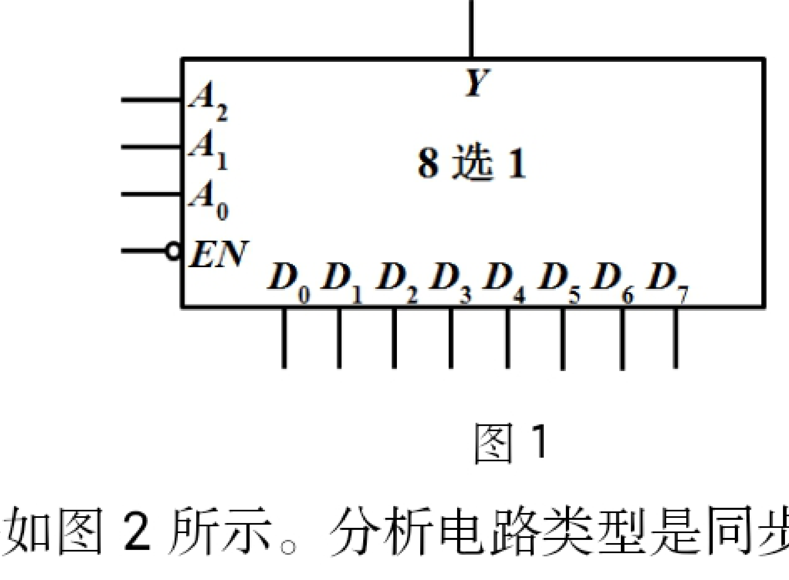
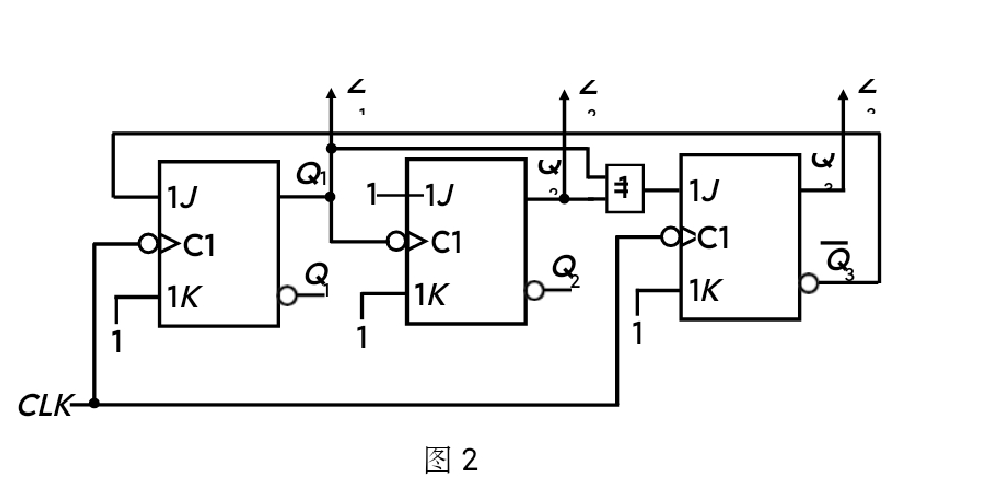
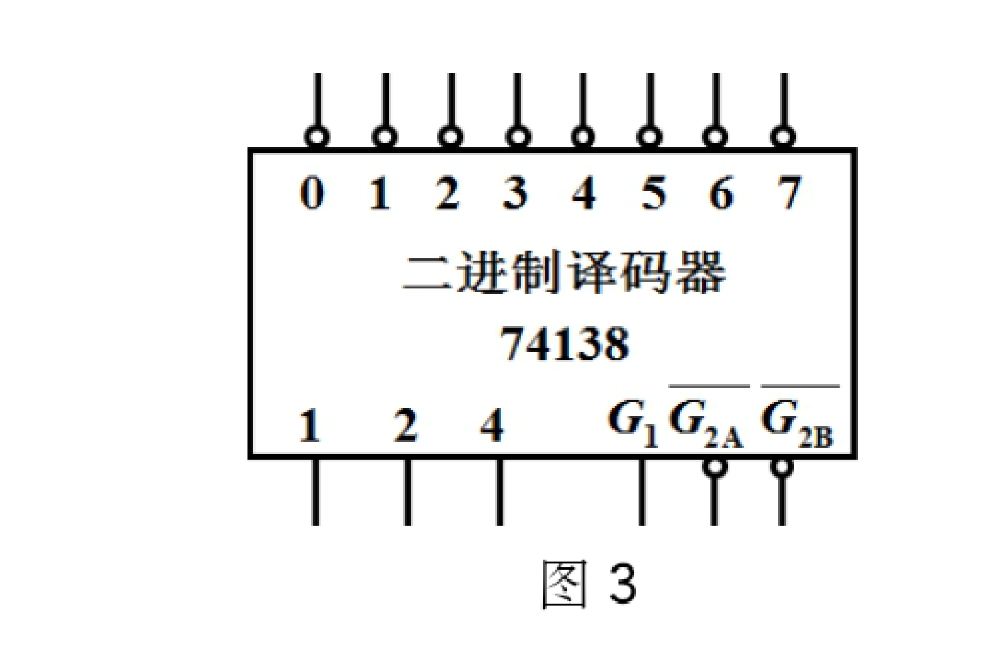

# 河南大学软件学院 2019～2020 学年第一学期期末考试

## 《数字逻辑》试卷（B 卷）

**考试方式：** 闭卷
**考试时间：** 120 分钟
**卷面总分：** 100 分

---

## 一、 单项选择题（每小题 2 分，共 10 分）

**1. 下列信号中，属于数字信号的是______。** `[   ]`

* A. 开关状态
* B. 交流电压
* C. 声波
* D. 无线电载波

**2. 8421 码 1000 1001 对应十进制数的是______。** `[   ]`

* A. 87
* B. 89
* C. 19
* D. 88

**3. 逻辑函数 $F(A,B,C) = \sum m(1,2,4,7)$ 可以表示成______。** `[   ]`

* A. $F(A,B,C) = \prod M(0,5,6)$
* B. $F(A,B,C) = (A \oplus B)C + AB$
* C. $F(A,B,C) = A \oplus B \oplus C$
* D. $F(A,B,C) = AB + AC$

**4. 下列中规模通用集成电路中，属于组合逻辑电路的是______。** `[   ]`

* A. 计数器
* B. 寄存器
* C. 移位寄存器
* D. 加法器

**5. 构造一个模 4 的计数器，需要______个触发器。** `[   ]`

* A. 1
* B. 2
* C. 3
* D. 4

---

## 二、 判断题（正确的记 “√”，错误的记 “×”。每小题 2 分，共 10 分）

**1. 已知 $X + Y = X \cdot Y$，那么一定有 $X = Y$。** `(   )`

**2. 由逻辑门构成的电路是组合逻辑电路。** `(   )`

**3. 异步时序逻辑电路中触发器的状态变化发生在不同的时刻。** `(   )`

**4. 同一逻辑函数的两个最大项 $M_i + M_j = 1$。** `(   )`

**5. 奇偶校验码不但能发现错误，而且能纠正错误。** `(   )`

---

## 三、 计算分析题（共 50 分）

**1. 已知待发送的信息 10011，采用偶校验码，求出检验位，并写出完整的偶校验码。（5 分）**

**2. 已知函数 $F(A,B,C) = AB + A\overline{C}$，求其反函数 $\overline{F(A,B,C)}$。（5 分）**

**3. 将下列函数化简为最简与或表达式。（10 分）**

$$
F = AB + A\overline{C} + \overline{B}\overline{C} + B\overline{C} + \overline{B}\overline{D} + B\overline{D} + ADE
$$

**4. 列出下列函数的真值表，并求其最小项之和表达式。（10 分）**

$$
F(A,B,C) = \overline{\overline{A}\overline{C} + BC}
$$

**5. 已知函数的最小项之和表达式为 $F(A,B,C) = \sum m(0,1,2,5)$，试利用数据选择器实现该函数。8 选 1 数据选择器的逻辑符号如图 1 所示。（10 分）**

  
  
图 1

**6. 时序逻辑电路如图 2 所示。分析电路类型是同步还是异步，并求出 $Q_1$ 和 $Q_3$ 的次态方程。（10 分）**

  
  
图 2

---

## 四、 设计应用题（共 30 分）

**用译码器 74138 和与非门设计一个加/减法器。该电路在 M 控制下进行加、减运算。当 M=0 时，实现全加器功能；当 M=1 时，实现全减器功能。74138 的逻辑符号如图 3 所示。要求如下：**

**(1) 分析该电路 of 输入变量和输出变量的个数，并定义变量名称。（5 分）**

**(2) 根据题意，列出该加/减法器的真值表，写出函数表达式并化为最简与或式。（13 分）**

**(3) 分析说明需要占用多少片 74138。（2 分）**

**(4) 画出电路图。（10 分）**

  
  
图 3

