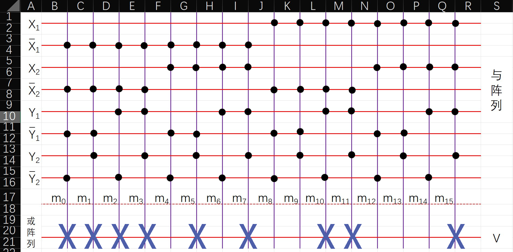

# 使用 PROM 设计输血-受血判别电路

## 1. 题目要求

使用 74138（3 线-8 线译码器）或 74151（8 路选择器）或 PROM 或 PLA 设计一个输血-受血判别电路。当输血者和受血者的血型符合下列规则时，配型成功，受血者可接受输血者提供的血液：

1. **A 型血**可以输给 A 型或 AB 型血的人；
2. **B 型血**可以输给 B 型或 AB 型血的人；
3. **AB 型血**只能输给 AB 型血的人；
4. **O 型血**可以输给 A、B、AB 或 O 型血的人。

---

## 2. 逻辑状态编码与变量定义

一共有四种血型：`O`、`A`、`B`、`AB`，因此可以用两位二进制数来表示输血者和受血者的血型。

设 `O` 为 `00`，`A` 为 `01`，`B` 为 `10`，`AB` 为 `11`：

| 血型 | O | A | B | AB |
| :---: | :---: | :---: | :---: | :---: |
| **编码** | 00 | 01 | 10 | 11 |

- **输入变量**：
  - $X_1 X_2$：输血者的血型编码
  - $Y_1 Y_2$：受血者的血型编码
- **输出变量**：
  - $V$：电路输出（$V = 1$ 表示配型成功，$V = 0$ 表示配型失败）

---

## 3. 真值表

下面给出配型成功（$V = 1$）时的真值表（$V = 0$ 的项略去）：

| $X_1$ | $X_2$ | $Y_1$ | $Y_2$ | $V$ |
| :---: | :---: | :---: | :---: | :---: |
|   0   |   0   |   0   |   0   |   1   |
|   0   |   0   |   0   |   1   |   1   |
|   0   |   0   |   1   |   0   |   1   |
|   0   |   0   |   1   |   1   |   1   |
|   0   |   1   |   0   |   1   |   1   |
|   0   |   1   |   1   |   1   |   1   |
|   1   |   0   |   1   |   0   |   1   |
|   1   |   0   |   1   |   1   |   1   |
|   1   |   1   |   1   |   1   |   1   |

---

## 4. 逻辑表达式与 PROM 阵列图

由真值表可知，逻辑函数的**最小项之和**表达式为：

$$F(X_1, X_2, Y_1, Y_2) = \sum m(0, 1, 2, 3, 5, 7, 10, 11, 15)$$

### PROM 阵列图

画出该转换电路的 PROM 阵列图，如图所示：

---

## 5. 参考资料

- [EEPROM 电路设计 - 220nf 绿波电龙 - 博客园](https://www.cnblogs.com/mahaidong/p/16208033.html)