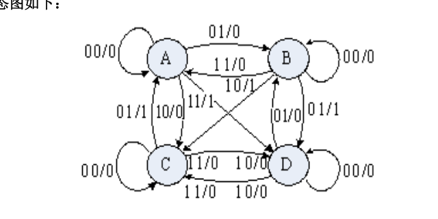
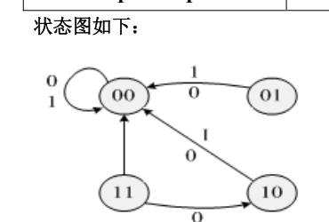
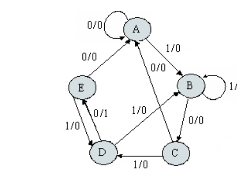
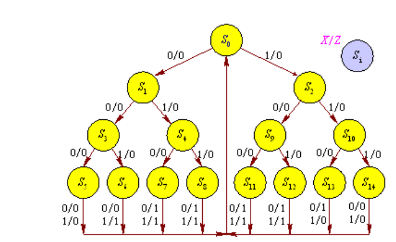
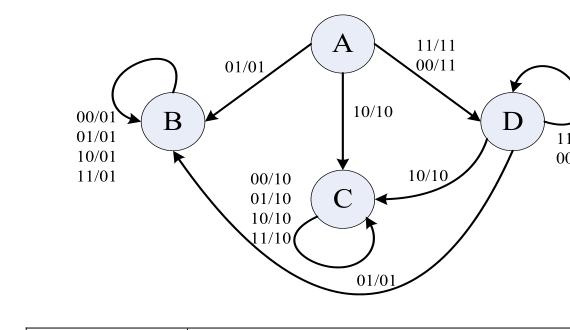
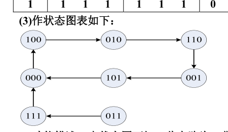

# 第四、五章课后习题答案

---

## 第四章

**4-1**：（略）

**4-2**：
* 激励方程：
  $$
  \begin{aligned}
  D &= J = Y_1 \\
  K &= Y_2 \\
  T &= Z
  \end{aligned}
  $$
* 输出方程与次态方程：
  $$
  \begin{aligned}
  Y_1 &= x_1 + y_1 \\
  Y_2 &= x_1 \oplus y_2 \\
  Z &= \overline{x_1 \cdot x_2 \cdot \overline{y_1} \cdot y_3} = \overline{x_1} + \overline{x_2} + y_1 + \overline{y_3}
  \end{aligned}
  $$

**4-3**：状态图如下：

  

**4-4**：

| 现态 | $x_0 x_1 = 00$ | $x_0 x_1 = 01$ | $x_0 x_1 = 11$ | $x_0 x_1 = 10$ |
| :---: | :---: | :---: | :---: | :---: |
| **0** | 1/0 | 0/0 | 0/1 | 0/1 |
| **1** | 1/0 | 0/1 | 0/0 | 1/0 |

**4-5**：为了分析方便，可以先列出其相应的状态表（略），并进行分析：

当输入序列和相应的输出序列为 $00/0$ 时，A、B、C、D 都符合条件，但当序列为 $01/1$ 时要转为 B 态或 C 态，就排除了 A、D 态；下一个序列为 $00/0$ 时，B、C 保持原态，接着序列为 $10/0$ 时，B 态转为 A 态，C 态转为 D 态，但当最后一个序列为 $11/1$ 时，只有 D 态才有可能输出 1，这就排除了 B 态。故确定该同步时序电路的初始状态为 C 态。

**4-6**：
(1) 列出电路的输出函数和激励函数表达式：
$$
\begin{aligned}
Z_1 &= Q_1 \\
J_1 &= Q_1\overline{Q_2} \\
J_2 &= \overline{x}Q_2 \\
Z_2 &= Q_2 \\
K_1 &= Q_1\overline{Q_2} + xQ_2 \\
K_2 &= Q_2
\end{aligned}
$$

(2) 建立状态转移真值表：

| 输入 $x$ | 现态 $Q_1$ | 现态 $Q_2$ | 激励 $J_1$ | 激励 $K_1$ | 激励 $J_2$ | 激励 $K_2$ | 次态 $Q_1^{(n+1)}$ | 次态 $Q_2^{(n+1)}$ |
| :---: | :---: | :---: | :---: | :---: | :---: | :---: | :---: | :---: |
| 0 | 0 | 0 | 0 | 0 | 0 | 0 | 0 | 0 |
| 0 | 0 | 1 | 0 | 0 | 1 | 1 | 0 | 0 |
| 0 | 1 | 0 | 1 | 1 | 0 | 0 | 0 | 0 |
| 0 | 1 | 1 | 0 | 0 | 1 | 1 | 1 | 0 |
| 1 | 0 | 0 | 0 | 0 | 0 | 0 | 0 | 0 |
| 1 | 0 | 1 | 0 | 1 | 0 | 1 | 0 | 0 |
| 1 | 1 | 0 | 1 | 1 | 0 | 0 | 0 | 0 |
| 1 | 1 | 1 | 0 | 1 | 0 | 1 | 0 | 0 |

(3) 作状态表如下：

| 现态 $Q_1 Q_2$ | 次态 $Q_1^{(n+1)} Q_2^{(n+1)}$ ($x=0$) | 次态 $Q_1^{(n+1)} Q_2^{(n+1)}$ ($x=1$) |
| :---: | :---: | :---: |
| 0 0 | 0 0 | 0 0 |
| 0 1 | 0 0 | 0 0 |
| 1 0 | 0 0 | 0 0 |
| 1 1 | 1 0 | 0 0 |

状态图如下：

  

由图可见，电路的逻辑功能为：在时钟脉冲作用下，输入任意序列 $x$ 均使电路返回 00 状态。

**4-7**：略。

**4-8**：假设初始状态为 A，准备接收一组新的数据，B 为接收一位有效数据，C 为接收到两位有效数据，D 为连续接收到三位有效数据，E 为检测到 1010 序列的状态，则其状态图为：

  

**4-9**：
(1) 确定输入变量 $X$ 和输出变量 $Z$，串行输入余 3 码，高位在前，低位在后；
(2) 设置状态：电路属于串行码组检测，对输入序列每四位一组进行检测，然后复位。因此从初始状态 $S_0$ 开始每接收一位代码就设置一个状态 $S_i$，四位一组。状态树如图所示：

  

**4-11**：作隐含表，分析得到最大等效类为：$(A,D)$，$(B,E)$，$(C,F)$，$G$，$H$。 分别用状态 $a, b, c, d, e$ 表示 $(A,D)$，$(B,E)$，$(C,F)$，$G$，$H$。可得简化后的状态表：

| 现态 | 次态／输出 ($x=0$) | 次态／输出 ($x=1$) |
| :---: | :---: | :---: |
| **a** | b/0 | a/0 |
| **b** | a/1 | c/0 |
| **c** | c/0 | a/1 |
| **d** | e/1 | d/1 |
| **e** | c/1 | b/1 |

**4-12**：
(1) 画出隐含表，可以得出五个最大相容类，为：$(A,B)$，$(C,D)$，$(C,E)$，$(A,D)$，$(B,C)$。
(2) 作闭覆盖表：

| 最大相容类 | A | B | C | D | E | 闭合条件 ($x=0$) | 闭合条件 ($x=1$) |
| :--- | :---: | :---: | :---: | :---: | :---: | :---: | :---: |
| **AB** | $\checkmark$ | $\checkmark$ | | | | D (AD) | CE |
| **AD** | $\checkmark$ | | | $\checkmark$ | | AD | C |
| **BC** | | $\checkmark$ | $\checkmark$ | | | D | E |
| **CD** | | | $\checkmark$ | $\checkmark$ | | A | CE |
| **CE** | | | $\checkmark$ | | $\checkmark$ | B | CE |

根据最小闭覆盖的原则，可以选择 $(A,B)$、$(C,D)$、$(C,E)$（注意，方案不止一种），分别用 $a, b, c$ 表示最小相容类 $(A,B)$、$(C,D)$、$(C,E)$，则可得到最小化状态表（略）。

**4-13**：
(1) 先化简给定的状态表。给定的状态表中共有 A、B、C、D 四个状态，通过分析其中 B 和 C 是可以合并的最大相容类，可看成一个状态，如 B 态。
(2) 根据状态分配原则：
    1. A 和 B 应分配相邻代码；
    2. A 和 B，B 和 D 应分配相邻代码；
    3. A 和 B、B 和 D 应分配相邻代码；
    4. 状态 B 的代码应分配为 00。

代码分配结果：B 为 00；A 为 01；D 为 10。C 为 11 可作无关项处理。

**4-14**：
(1) 画出了分别用 J-K、T 和 D 触发器作同步时序电路的存储电路时的激励函数和输出函数卡诺图，得到各触发器的激励函数 and 输出函数的表达式，然后画出使用不同触发器的逻辑电路图。

* **J-K 触发器**：
  $$
  \begin{aligned}
  J_2 &= x + y_1 \\
  K_2 &= \overline{x} + y_1 \\
  J_1 &= \overline{x}\overline{y_2} + xy_2 = \overline{x \oplus y_2} \\
  K_1 &= x \\
  Z &= y_2\overline{y_1}
  \end{aligned}
  $$
* **D 触发器**：
  $$
  \begin{aligned}
  D_2 &= x\overline{y_1} + \overline{y_2}y_1 \\
  D_1 &= x\overline{y_2} + \overline{x}y_1 + xy_2\overline{y_1} = x \oplus (y_2\overline{y_1}) \\
  Z &= y_2\overline{y_1}
  \end{aligned}
  $$
* **T 触发器**：
  $$
  \begin{aligned}
  T_2 &= x\overline{y_2} + y_1 + \overline{x}y_2 = y_1 + x \oplus y_2 \\
  T_1 &= \overline{x}\overline{y_2}y_1 + xy_2 + xy_1 = x \oplus y_2 + y_1 \\
  Z &= y_2\overline{y_1}
  \end{aligned}
  $$
  （电路图略）

(2) 通过电路分析，使用 JK 触发器线路较为简单，门电路较少，成本较低。

**4-15**：
(1) 作原始状态图和状态表：

  

| 现态 | $xy = 00$ | $xy = 01$ | $xy = 11$ | $xy = 10$ |
| :---: | :---: | :---: | :---: | :---: |
| **A** | D/11 | B/01 | D/11 | C/10 |
| **B** | B/01 | B/01 | B/01 | B/01 |
| **C** | C/10 | C/10 | C/10 | C/10 |
| **D** | D/11 | B/01 | D/11 | C/10 |

(2) 状态简化：
用 A 代替 A、D，可得简化后的状态表：

| 现态 | $xy = 00$ | $xy = 01$ | $xy = 11$ | $xy = 10$ |
| :---: | :---: | :---: | :---: | :---: |
| **A** | A/11 | B/01 | A/11 | C/10 |
| **B** | B/01 | B/01 | B/01 | B/01 |
| **C** | C/10 | C/10 | C/10 | C/10 |

(3) 状态编码：
根据状态分配原则可以确定：A 的编码为 10；B 的编码为 00；C 的编码为 01，得到二进制状态表：

| 现态 $Q_1 Q_2$ | $xy = 00$ | $xy = 01$ | $xy = 11$ | $xy = 10$ |
| :---: | :---: | :---: | :---: | :---: |
| **00** | 00/01 | 00/01 | 00/01 | 00/01 |
| **01** | 01/10 | 01/10 | 01/10 | 01/10 |
| **10** | 10/11 | 00/01 | 10/11 | 01/10 |

(4) 列出激励函数和输出函数表达式：
$$
\begin{aligned}
D_1 &= Q_1\overline{x}\overline{y} + Q_1xy \\
Z_x &= Q_2 + Q_1x + \overline{Q_1}\overline{y} \\
D_2 &= Q_2 + \overline{Q_1}x\overline{y} \\
Z_y &= \overline{Q_1}\overline{Q_2} + Q_1\overline{x} + Q_1y
\end{aligned}
$$

(5) 画逻辑图（略）

---

## 习题五

**5-1**：
(1) 列出电路的激励函数和输出函数表达式：
$$
\begin{cases}
J_1 = K_1 = 1 \\
CP_1 = CP
\end{cases}
$$
$$
\begin{cases}
J_2 = \overline{Q_3}, \quad K_2 = 1 \\
CP_2 = Q_1
\end{cases}
$$
$$
\begin{cases}
J_3 = Q_2\overline{Q_3}, \quad K_3 = 1 \\
CP_3 = Q_1
\end{cases}
$$

(2) 作状态真值表：

| 输入 $CP$ | 现态 $Q_1 Q_2 Q_3$ | $J_1$ | $K_1$ | $CP_1$ | $J_2$ | $K_2$ | $CP_2$ | $J_3$ | $K_3$ | $CP_3$ | 次态 $Q_1^{(n+1)} Q_2^{(n+1)} Q_3^{(n+1)}$ |
| :---: | :---: | :---: | :---: | :---: | :---: | :---: | :---: | :---: | :---: | :---: | :---: |
| 1 | 0 0 0 | 1 | 1 | 1 | 1 | 1 | 0 | 0 | 1 | 0 | 1 0 0 |
| 1 | 0 0 1 | 1 | 1 | 1 | 0 | 1 | 0 | 0 | 1 | 0 | 1 0 1 |
| 1 | 0 1 0 | 1 | 1 | 1 | 1 | 1 | 0 | 1 | 1 | 0 | 1 1 0 |
| 1 | 0 1 1 | 1 | 1 | 1 | 0 | 1 | 0 | 0 | 1 | 0 | 1 1 1 |
| 1 | 1 0 0 | 1 | 1 | 1 | 0 | 1 | 1 | 0 | 1 | 1 | 0 1 0 |
| 1 | 1 0 1 | 1 | 1 | 1 | 0 | 1 | 1 | 0 | 1 | 1 | 0 0 0 |
| 1 | 1 1 0 | 1 | 1 | 1 | 1 | 1 | 1 | 1 | 1 | 1 | 0 0 1 |
| 1 | 1 1 1 | 1 | 1 | 1 | 0 | 1 | 1 | 0 | 1 | 1 | 0 0 0 |

(3) 作状态图表如下：

  

(4) 功能描述：由状态图可知，此电路为一带自启动能力的六进制计数器。
