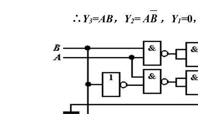
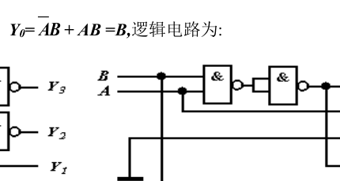
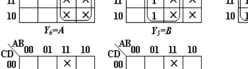
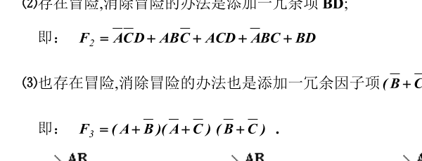

# 第一、二、三章课后习题解答参考

---

## 第一章

**1-2**：
$$11100.101_2 \quad 100.101_2 \quad 10.1101_2 \quad 10.1_2$$

**1-3**：
(1) $(1110101)_2 = (117)_{10} = (165)_8 = (75)_{16}$
(2) $(0.110101)_2 = (0.828125)_{10} = (0.65)_8 = (0.\text{D}4)_{16}$
(3) $(10111.01)_2 = (23.25)_{10} = (27.2)_8 = (17.4)_{16}$

**1-4**：
(1) $(29)_{10} = (11101)_2 = (35)_8 = (1\text{D})_{16}$
(2) $(0.207)_{10} = (0.00111)_2 = (0.16)_8 = (0.38)_{16}$
(3) $(33.333)_{10} = (100001.01011)_2 = (41.26)_8 = (21.58)_{16}$

**1-7**：
$[N]_\text{原} = 1.1010$；$[N]_\text{反} = 1.0101$；$N = -0.1010_2$

**1-10**：
(1) $(0110 \; 1000 \; 0011)_{8421\text{BCD}} = (683)_{10} = (1010101011)_2$
(2) $(0100 \; 0101.1001)_{8421\text{BCD}} = (45.9)_{10} = (101101.1110)_2$

**1-11**：
(1) $(578)_{10} = (0101 \; 0111 \; 1000)_{8421\text{BCD}} = (1000 \; 1010 \; 1011)_{\text{余三码}} = (1001000010)_2 = (1101100011)_{\text{Gray}}$
(2) $(1100110)_2 = (102)_{10} = (0001 \; 0000 \; 0010)_{8421\text{BCD}} = (0100 \; 0011 \; 0101)_{\text{余三码}} = (1010101)_{\text{Gray}}$

**1-12**：
$(27)_{10}$，$(0011 \; 1000)_{8421\text{BCD}}$，$(135.6)_8$，$(110111001)_2$，$(3\text{AF})_{16}$

---

## 第二章

**2-1**：略

**2-2**：略

**2-3**：略

**2-4**：
(1) $\overline{F} = (\overline{A} + C)(B + \overline{C})$；$F' = (A + \overline{C})(\overline{B} + C)$
(2) $\overline{F} = (A + \overline{B})(\overline{B} + C)(\overline{A} + \overline{C}D)$；$F' = (\overline{A} + B)(B + \overline{C})(A + C\overline{D})$
(3) $\overline{F} = \overline{A} + B[\overline{(\overline{C} + D)}\,\overline{(E + \overline{F})} + \overline{G}]$；$F' = A + \overline{B}[(C + \overline{D})(\overline{E} + F) + G]$
(4) $\overline{F} = \overline{A}(B + \overline{C} + \overline{\overline{D} + \overline{E}})$；$F' = A \cdot \overline{ B \cdot \overline{C} \cdot \overline{\overline{D} \cdot \overline{E}} }$
(5) $\overline{F} = (\overline{A} + B)(B + \overline{AC})$；$F' = \overline{\overline{A}B} + B\overline{(\overline{A} + C)}$

**2-5**：
(1) 正确；
(2) 若 $A=0$ 时，逻辑关系不满足；
(3) 若 $A=1$ 时，逻辑关系不满足；
(4) 正确；

**2-6**：
(1) $F = A + B$
(2) $F = 1$
(3) $F = A + \overline{B}\overline{D}$
(4) $F = A \cdot (C + D) \cdot E$
(5) $F = BC$

**2-7**：
(1) $F(A,B,C) = \overline{A}\overline{B}\overline{C} + A\overline{B}\overline{C} + A\overline{B}C + AB\overline{C} + ABC = \sum m(0,4,5,6,7)$
    $F(A,B,C) = (A + B + \overline{C})(A + \overline{B} + \overline{C})(A + \overline{B} + C) = \prod M(1,2,3)$
    卡诺图方法更简洁。
(2) $F(A,B,C,D) = \sum m(4,5,6,7,12,13,14,15)$
    $F(A,B,C,D) = \prod M(0,1,2,3,8,9,10,11)$
(3) $F(A,B,C,D) = \sum m(0,1,2,3,4)$
    $F(A,B,C,D) = \prod M(5,6,7,8,9,10,11,12,13,14,15)$

**2-8**：
(1) $F(A,B,C) = \sum m(0,1,2,4)$
(2) $F(A,B,C) = \sum m(0,3,5,6)$
(3) $F(A,B,C) = \sum m(3,5,6,7)$

**2-9**：略

**2-10**：
(1) $F(A,B,C) = \overline{A}\overline{C} + \overline{B}\overline{C} = \overline{(A + B)}\overline{C}$
(2) $F(A,B,C) = \overline{A}\overline{B} + AC + B\overline{C} = (A + \overline{B} + \overline{C})(\overline{A} + B + C)$
(3) $F(A,B,C,D) = B + D = B + D$

**2-11**：$F$ 与 $G$ 互补。

**2-12**：
(1) $a=1$ 时；
(2) $a=b=1$ 时；

**2-13**：
(1) $F(A,B,C,D) = \overline{A} + BD$，$\sum d(1,3,4,5,6,8,10) = 0$；
(2)
    $$
    \begin{aligned}
    F_1(A,B,C,D) &= \overline{B}\overline{D} + A\overline{B}\overline{C}D + \overline{A}BCD + ABD \\
    F_2(A,B,C,D) &= \overline{B}\overline{D} + \overline{A}\overline{C}D + \overline{A}BC \\
    F_3(A,B,C,D) &= \overline{A}\overline{B}\overline{C}\overline{D} + \overline{A}BCD + \overline{A}BC
    \end{aligned}
    $$
    多输出函数共有 7 个不同与项，其中包含逻辑变量总个数为 22 个。

---

## 第三章

**3-1**：
(1)
    $$
    \begin{aligned}
    F(A,B,C) &= \overline{A}\overline{C} + BC = \overline{ \overline{\overline{A}\overline{C}} \cdot \overline{BC} } \\
    F(A,B,C) &= (\overline{A} + C)(B + \overline{C}) = \overline{ \overline{\overline{A} + C} + \overline{B + \overline{C}} }
    \end{aligned}
    $$
(2)
    $$
    \begin{aligned}
    F(A,B,C) &= \prod M(3,6) = \overline{B} + \overline{A}C + AC = \overline{ B \cdot \overline{\overline{A}C} \cdot \overline{AC} } \\
    F(A,B,C) &= \prod M(3,6) = (A + \overline{B} + \overline{C})(\overline{A} + \overline{B} + C) = \overline{ \overline{A + \overline{B} + \overline{C}} + \overline{\overline{A} + \overline{B} + C} }
    \end{aligned}
    $$
(3)
    $$
    \begin{aligned}
    F(A,B,C,D) &= \overline{A}\overline{C} + B\overline{C} + \overline{A}B = \overline{ \overline{\overline{A}\overline{C}} \cdot \overline{B\overline{C}} \cdot \overline{\overline{A}B} } \\
    F(A,B,C,D) &= \overline{ \overline{\overline{A} + B + \overline{C}} + \overline{A + B + C} }
    \end{aligned}
    $$
(4)
    $$
    \begin{aligned}
    F(A,B,C,D) &= \overline{ \overline{A}B + \overline{A}C + \overline{B}CD } = \overline{\overline{A}B} \\
    F(A,B,C,D) &= \overline{ \overline{\overline{A} + B} } = \overline{ \overline{\overline{A} + B} + 0 }
    \end{aligned}
    $$

**3-2**：
(1) $F(A,B,C) = \overline{ \overline{\overline{A}\overline{B}} + \overline{\overline{A}\overline{C}} + \overline{\overline{B}\overline{C}} }$
(2) $F(A,B,C,D) = \overline{ \overline{A\overline{C}D} + \overline{\overline{A}\overline{B}C} + \overline{\overline{B}CD} + \overline{B\overline{C}D} }$

**3-3**：略

**3-4**：
$$F(A,B,C) = \overline{ [A + (B + \overline{C})(\overline{B} + C)] \cdot [\overline{A}C + (B + \overline{C})(\overline{B} + C)] } = \overline{A}\overline{B}C + A\overline{B}\overline{C} + ABC$$
该电路为模 3 余 1 电路。

**3-5**：
(1) 两个一位二进制数的全减器，产生差 $F$ 与借位 $G$；
(2) 两个一位二进制数的全加器，产生和 $F$ 与进位 $G$；

**3-6**：
$F_1 = \overline{A}B$；$F_2 = AB$；$F_3 = A \oplus B$
当 $A=B$ 时， $F_1, F_2, F_3$ 等效。

**3-7**：
(1) $Y = X^2$；（$Y$ 也用二进制数表示）
因为一个两位二进制正整数的平方的二进制数最多有四位，故输入端用 $A, B$ 两个变量，输出端用 $Y_3, Y_2, Y_1, Y_0$ 四个变量。

* **(1) 真值表**：

| $AB$ | $Y_3$ | $Y_2$ | $Y_1$ | $Y_0$ |
| :---: | :---: | :---: | :---: | :---: |
| **00** | 0 | 0 | 0 | 0 |
| **01** | 0 | 0 | 0 | 1 |
| **10** | 0 | 1 | 0 | 0 |
| **11** | 1 | 0 | 0 | 1 |

* **(2) 真值表**（对应 $Y = X^3$）：

| $AB$ | $Y_4$ | $Y_3$ | $Y_2$ | $Y_1$ | $Y_0$ |
| :---: | :---: | :---: | :---: | :---: | :---: |
| **00** | 0 | 0 | 0 | 0 | 0 |
| **01** | 0 | 0 | 0 | 0 | 1 |
| **10** | 0 | 1 | 0 | 0 | 0 |
| **11** | 1 | 1 | 0 | 1 | 1 |

$\therefore Y_3 = AB$, $Y_2 = A\overline{B}$, $Y_1 = 0$, $Y_0 = A\overline{B} + AB = B$。
逻辑电路为：

  
  

**3-8**：
$Y = C_1\overline{X} + C_0X$ （提示：将 $X$ 看作输入量，列出真值表，画出卡诺图化简，画出逻辑电路图）

**3-9**：
设计一个一位十进制数（8421BCD 码）乘以 5 的组合逻辑电路，电路的输出为十进制数（8421BCD 码）。
解：因为一个一位十进制数（8421BCD 码）乘以 5 所得的十进制数（8421BCD 码）最多有八位，故输入端用 $A, B, C, D$ 四个变量，输出端用 $Y_7, Y_6, Y_5, Y_4, Y_3, Y_2, Y_1, Y_0$ 八个变量。

* **真值表**：

| $ABCD$ | $Y_7$ | $Y_6$ | $Y_5$ | $Y_4$ | $Y_3$ | $Y_2$ | $Y_1$ | $Y_0$ |
| :---: | :---: | :---: | :---: | :---: | :---: | :---: | :---: | :---: |
| **0000** | 0 | 0 | 0 | 0 | 0 | 0 | 0 | 0 |
| **0001** | 0 | 0 | 0 | 0 | 0 | 1 | 0 | 1 |
| **0010** | 0 | 0 | 0 | 1 | 0 | 0 | 0 | 0 |
| **0011** | 0 | 0 | 0 | 1 | 0 | 1 | 0 | 1 |
| **0100** | 0 | 0 | 1 | 0 | 0 | 0 | 0 | 0 |
| **0101** | 0 | 0 | 1 | 0 | 0 | 1 | 0 | 1 |
| **0110** | 0 | 0 | 1 | 1 | 0 | 0 | 0 | 0 |
| **0111** | 0 | 0 | 1 | 1 | 0 | 1 | 0 | 1 |
| **1000** | 0 | 1 | 0 | 0 | 0 | 0 | 0 | 0 |
| **1001** | 0 | 1 | 0 | 0 | 0 | 1 | 0 | 1 |
| **其他(无关项)** | $\times$ | $\times$ | $\times$ | $\times$ | $\times$ | $\times$ | $\times$ | $\times$ |

用卡诺图化简可得：
$$
\begin{aligned}
Y_7 &= 0, \quad Y_6 = A, \quad Y_5 = B, \quad Y_4 = C \\
Y_3 &= 0, \quad Y_2 = D, \quad Y_1 = 0, \quad Y_0 = D
\end{aligned}
$$

逻辑电路图如下：

  

在化简时由于利用了无关项，本逻辑电路不需要任何逻辑门。

**3-10**：
(1) 根据给定的逻辑功能建立真值表：

| 输入 $y_1 y_0$ | 输入 $x_1 x_0$ | 输出 $z_1 z_2$ |
| :---: | :---: | :---: |
| 00 | 00 | 11 |
| 00 | 01 | 01 |
| 00 | 10 | 01 |
| 00 | 11 | 01 |
| 01 | 00 | 10 |
| 01 | 01 | 11 |
| 01 | 10 | 01 |
| 01 | 11 | 01 |
| 10 | 00 | 10 |
| 10 | 01 | 10 |
| 10 | 10 | 11 |
| 10 | 11 | 01 |
| 11 | 00 | 10 |
| 11 | 01 | 10 |
| 11 | 10 | 10 |
| 11 | 11 | 11 |

(2) 根据真值表，列出逻辑函数表达式，并化简为“与非”式：
$$
\begin{aligned}
Z_1 &= y_1y_0 + \overline{x_1}\overline{x_0} + y_1\overline{x_1} + \overline{y_1}y_0\overline{x_1}x_0 + y_1\overline{y_0}x_1\overline{x_0} \\
    &= \overline{ \overline{y_1y_0} \cdot \overline{\overline{x_1}\overline{x_0}} \cdot \overline{y_1\overline{x_1}} \cdot \overline{\overline{y_1}y_0\overline{x_1}x_0} \cdot \overline{y_1\overline{y_0}x_1\overline{x_0}} }
\end{aligned}
$$
$$
\begin{aligned}
Z_2 &= \overline{y_1}\overline{y_0} + x_1x_0 + \overline{y_1}x_1 + \overline{y_1}y_0\overline{x_1}x_0 + y_1\overline{y_0}x_1\overline{x_0} \\
    &= \overline{ \overline{\overline{y_1}\overline{y_0}} \cdot \overline{x_1x_0} \cdot \overline{\overline{y_1}x_1} \cdot \overline{\overline{y_1}y_0\overline{x_1}x_0} \cdot \overline{y_1\overline{y_0}x_1\overline{x_0}} }
\end{aligned}
$$

(3) 根据逻辑函数表达式画出逻辑电路图。（略）

**3-11**：
设 4 位二进制码为 $ABCD$，检测函数为：
$$F = \sum m(0,3,5,6,9,10,12,15) = \overline{A \oplus B \oplus C \oplus D}$$
逻辑电路图略。

**3-12**：
(1) $F_1 = AB + \overline{A}\overline{C}D + BC$
(2) $F_2 = \overline{A}\overline{C}D + AB\overline{C} + ACD + \overline{A}BC$
(3) $F_3 = (A + \overline{B})(\overline{A} + \overline{C})$

Karnaugh 图及包围圈如下：

  

解：
1. 对于 (1)，不存在冒险；
2. 对于 (2)，存在冒险，消除冒险的办法是添加一冗余项 $BD$：
   即：$F_2 = \overline{A}\overline{C}D + AB\overline{C} + ACD + \overline{A}BC + BD$
3. 对于 (3)，也存在冒险，消除冒险的办法也是添加一冗余因子项 $(\overline{B} + \overline{C})$：
   即：$F_3 = (A + \overline{B})(\overline{A} + \overline{C})(\overline{B} + \overline{C})$。

**3-13**：
$$F = \overline{ \overline{\overline{A}\overline{B}\overline{C} + \overline{A}BD + \overline{B}C\overline{D} + \overline{A}\overline{C}D + \overline{A}\overline{B}D} }$$
其中后面两项为增加的冗余项；
其“或非”形式为：
$$F = \overline{ \overline{A+B+C} + \overline{A+\overline{B}+\overline{D}} + \overline{B+\overline{C}+D} + \overline{A+C+\overline{D}} + \overline{A+B+\overline{D}} }$$
