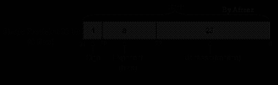
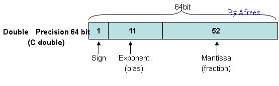
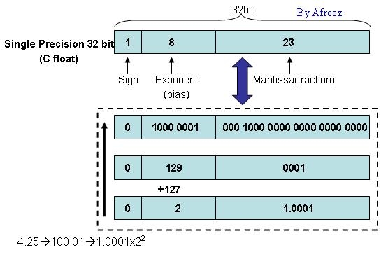

# 定点与浮点运算 DSP 的比较

定点运算 DSP 在应用中已取得了极大的成功，而且仍然是 DSP 应用的主体。然而，随着对 DSP 处理速度与精度、存储器容量、编程的灵活性和方便性要求的不断提高，自 80 年代中后期以来，各 DSP 生产厂家陆续推出了各自的 32bit 浮点运算 DSP。

---

## 浮点运算 DSP 的优越性

和定点运算 DSP 相比，浮点运算 DSP 具有许多优越性：

1. **动态范围要大很多**
   定点 DSP 的字长每增加 $1\text{ bit}$，动态范围扩大 $6\text{ dB}$。$16\text{ bit}$ 字长的动态范围为 $96\text{ dB}$。程序员必须时刻关注溢出的发生。例如，在作图像处理时，图像旋转、移动等操作很容易产生溢出。这时，要么不断地移位定标，要么进行截尾。前者要耗费大量的程序空间 and 执行时间，后者则会带来图像质量的劣化。在处理低信噪比信号的场合，例如进行语音识别、雷达和声纳信号处理时，也会发生类似的问题。
   而 $32\text{ bit}$ 浮点运算 DSP 的动态范围可以达到 $1536\text{ dB}$，这不仅大大扩大了动态范围，提高了运算精度，还大大节省了运算时间和存储空间，因为大幅减少了定标、移位和溢出检查。

2. **运算速度高**
   由于浮点 DSP 的浮点运算是用硬件来实现的，可以在单周期内完成，因而其处理速度大大高于定点 DSP。这一优点在实现高精度复杂算法时尤为突出，为复杂算法的实时处理提供了保证。

3. **寻址空间大**
   $32\text{ bit}$ 浮点 DSP 的总线宽度较定点 DSP 宽得多，因而寻址空间也要大得多。这一方面为大型复杂算法提供了可能（因为省下的 DSP 目标子程序已使用到几十 MB 存储器或更多）；另一方面也为高级语言编译器、DSP 操作系统等高级工具软件的应用提供了条件。

4. **便于多处理器应用**
   DSP 的进一步发展必然是多处理器的应用。新型的浮点 DSP 已开始在通信口的设置和强化、资源共享等方面有所响应。

---

## 一、浮点与定点概述

> [!NOTE]
> **作者声明**  
> 作者：afreez (北京-中关村)  
> 联系方式：afreez.gan@gmail.com  
> 初次发布时间：2006-12-09  
> 初次发布在：[CSDN 博客](http://blog.csdn.net/ganxingming/)  
> 未经作者同意，不得用于商业或赢利性质目的。

### 1.1 相关定义说明

* **定点数**：通俗地讲，小数点固定的数。以人民币为例，我们日常经常说到的如 $123.45$ 元、$789.34$ 元等，默认情况下小数点后面有两位小数，即角、分。
  * 如果小数点在最高有效位的前面，则称为**纯小数定点数**，如 $0.12345$，$0.78934$ 等。
  * 如果小数点在最低有效位的后面，则称为**纯整数定点数**，如 $12345$，$78934$ 等。
* **浮点数**：一般说来，小数点不固定的数。比较容易的理解方式是参考科学记数法。拿上面的数字举例，如 $123.45$ 可以写成以下几种形式：
  * $12.345 \times 10^1$
  * $1.2345 \times 10^2$
  * $0.12345 \times 10^3$
  * ……  
  为了表示一个数，小数点的位置可以变化，即小数点不固定。

### 1.2 定点数与浮点数的对比

为了简单把问题描述清楚，这里均以十进制数字为例：

1. **表示的精度与范围不同**
   例如，我们用 4 个十进制数来表达一个数字。
   * 对于**定点数**（以定点整数为例），我们可以表示区间 $[0000, 9999]$ 中的任何一个数字。但是如果我们想表示类似 $1234.3$ 的数值就无能为力了，因为此时的表示精度为 $1/10^0 = 1$。
   * 如果采用**浮点数**（以规格化的科学记数法，即小数点前有一位有效位为例），则可以表示 $[0.000, 9.999]$ 之间的任何一个数字，表示的精度为 $1/10^3 = 0.001$。表示精度比上一种方式提高了很多，但是表示的范围却小了很多。
   
   **总结**：定点数表示的精度较低，但表示的数值范围较大；而浮点数恰恰相反。

2. **计算机中运算的效率不同**
   一般说来，定点数的运算在计算机中实现起来比较简单，效率较高；而浮点数的运算在计算机中实现起来比较复杂，效率相对较低。

3. **硬件依赖性**
   一般说来，只要有硬件提供运算部件，就会提供对定点数运算的支持；但不一定支持浮点数运算，例如很多嵌入式开发板就没有硬件浮点运算支持。

### 1.3 与 DSP 的关系

一般说来，DSP 处理器可以分为两大类：定点与浮点。两者相比较而言：
* **定点 DSP**：处理器速度快，功耗低，价格也便宜。
* **浮点 DSP**：计算精度高，动态范围大。

---

## 二、浮点数的存储格式

### 2.1 IEEE 754 浮点数标准

浮点数的小数点是不固定的，为了避免混乱，计算机中存储浮点数都遵循统一的规范，即由 IEEE 指定的 **IEEE Standard 754 for Binary Floating-Point Arithmetic**。

在 C 语言中，单精度（`float`）数据类型为 $32\text{ bits}$，具体格式如下图所示：

<div align="center">
  
</div>

整个 $32\text{ bits}$ 分为三部分：
1. **Sign**：符号位，占 $1\text{ bit}$。$0$ 表示正数，$1$ 表示负数。
2. **Exponent(bias)**：指数部分，占 $8\text{ bits}$，存储格式为移码存储，偏移量（bias）为 $127$。
3. **Mantissa(fraction)**：尾数部分，占 $23\text{ bits}$。

对应的双精度（`double`）类型的格式为：

<div align="center">
  
</div>

同样，$64\text{ bits}$ 也被分为了三部分（Sign占 $1\text{ bit}$，Exponent占 $11\text{ bits}$，Mantissa占 $52\text{ bits}$）。

---

### 2.2 实例解析与深入理解

#### 1. 浮点存储实例：4.25

例如，我们来分析浮点数 $4.25$ 在计算机中是如何存储的：

1. **二进制转换**：首先把 $4.25$ 转换成二进制，为 $(100.01)_2$。
2. **规格化**：写成科学记数法形式：$1.0001 \times 2^2$。
3. **对号入座**：
   * **Sign** = $0$ （正数）
   * **Exponent (bias)** = $2 + 127 = 129$ （偏移量为 $127$）
   * **Mantissa** = $1.0001 - 1.0 = 0001$ （规格化后，小数点前总是 $1$，因此在存储时省去该 $1$，这就是为什么 $23\text{ bits}$ 尾数可以表示 $24\text{ bits}$ 精度的原因）

对应的存储映射如下图所示：

<div align="center">
  
</div>

#### 2. 二进制解码实例

如果给定二进制数字串 `01000000100010000000000000000000` 并告诉你这是一个 `float` 值，逆向计算它的十进制值过程如下图所示：

<div align="center">
  
</div>

---

### 2.3 深入理解浮点存储格式（代码验证）

为了更深入地理解浮点数格式，我们使用 C 语言的强制类型转换来进行验证。

在 C 语言中，常规的浮点转整数是通过强制类型转换进行的：
```c
float f = 4.6;
int i;
i = (int)(f + 0.5); // i = 5 (四舍五入)
```

如果我们不使用 C 语言内置的强制类型转换，而是通过直接操作浮点数的底层存储结构来提取出整数部分，可以使用如下方法获取尾数：

```c
// 取 23 + 1 位的尾数部分（包括隐藏的 1）
int ival = ((*(int *)(&fval)) & 0x07fffff) | 0x800000;
```
