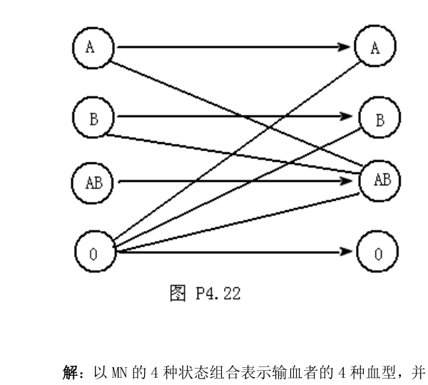
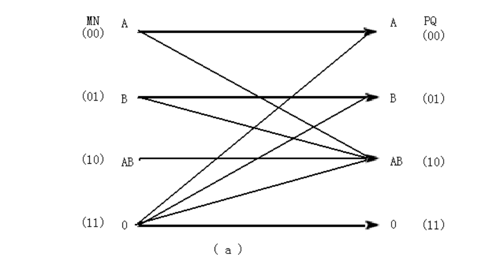
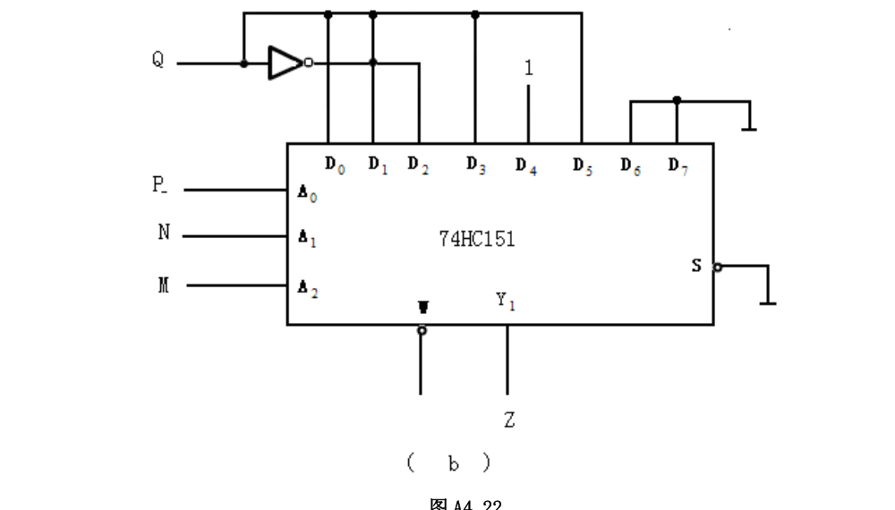

# 组合电路血型符合设计电路

---

## 课题背景及要求

人的血型有 A、B、AB、O 4种。输血时输血者的血型与受血者血型必须符合下图中用箭头指示的授受关系（图 P4.22）。试用数据选择器设计一个逻辑电路，判断输血者与受血者的血型是否符合上述规定。（提示：可以用两个逻辑变量的 4 种取值表示输血者的血型；用另外两个逻辑变量的 4 种取值表示受血者的血型。）

  

---

## 逻辑设计方案

### 1. 状态编码
以 $M, N$ 的 4 种状态组合表示输血者的 4 种血型，并以 $P, Q$ 的 4 种状态组合表示受血者的 4 种血型，编码分配如图 A4.22(a) 所示。
用 $Z$ 表示判断结果，$Z=0$ 表示符合输血要求，$Z=1$ 表示不符合要求。

  

### 2. 真值表
根据输血授受关系，可列出 $Z$ 与 $M, N, P, Q$ 之间逻辑关系的真值表（表 A4.22）：

| 输血者编码 ($M N$) | 输血者血型 | 受血者编码 ($P Q$) | 受血者血型 | 判断结果 ($Z$) |
| :---: | :---: | :---: | :---: | :---: |
| **00** | A | 00 | A | 0 |
| **00** | A | 01 | B | 1 |
| **00** | A | 10 | AB | 0 |
| **00** | A | 11 | O | 1 |
| **01** | B | 00 | A | 1 |
| **01** | B | 01 | B | 0 |
| **01** | B | 10 | AB | 0 |
| **01** | B | 11 | O | 1 |
| **10** | AB | 00 | A | 1 |
| **10** | AB | 01 | B | 1 |
| **10** | AB | 10 | AB | 0 |
| **10** | AB | 11 | O | 1 |
| **11** | O | 00 | A | 0 |
| **11** | O | 01 | B | 0 |
| **11** | O | 10 | AB | 0 |
| **11** | O | 11 | O | 0 |

### 3. 逻辑函数表达式
从真值表写出逻辑式为：
$$Z = \overline{M}\overline{N}\overline{P}Q + \overline{M}\overline{N}PQ + \overline{M}N\overline{P}\overline{Q} + \overline{M}NPQ + M\overline{N}\overline{P}\overline{Q} + M\overline{N}\overline{P}Q + M\overline{N}PQ$$

---

## 电路实现

本设计使用 **8选1数据选择器 (如 74HC151)** 来产生上述逻辑函数。

已知 8选1数据选择器的输出为：
$$Y = \overline{A_2}\overline{A_1}\overline{A_0}D_0 + \overline{A_2}\overline{A_1}A_0D_1 + \overline{A_2}A_1\overline{A_0}D_2 + \overline{A_2}A_1A_0D_3 + A_2\overline{A_1}\overline{A_0}D_4 + A_2\overline{A_1}A_0D_5 + A_2A_1\overline{A_0}D_6 + A_2A_1A_0D_7$$

将 $Z$ 变换成与 $Y$ 对应的形式：
$$Z = \overline{M}\overline{N}\overline{P}Q + \overline{M}\overline{N}PQ + \overline{M}N\overline{P}\overline{Q} + \overline{M}NPQ + M\overline{N}\overline{P}1 + M\overline{N}PQ + MNP'\overline{0} + MNP0$$
*(注：根据真值表，$M\overline{N}\overline{P}$ 项在 $Q=0$ 和 $Q=1$ 时均为 $1$，因而对应 $D_4=1$；$MN\overline{P}$ 与 $MNP$ 项在 $Q=0$ 和 $Q=1$ 时均为 $0$，因而对应 $D_6=D_7=0$)*

通过变量置换与引脚连接：
* **地址输入端**：令 $A_2 = M$，$A_1 = N$，$A_0 = P$；
* **数据输入端**：令 $D_0 = D_1 = D_3 = D_5 = Q$，$D_2 = \overline{Q}$，$D_4 = 1$，$D_6 = D_7 = 0$。

所得逻辑电路连接图如图 A4.22(b) 所示，此时数据选择器的输出 $Y$ 即为所求的判断结果 $Z$：

  

